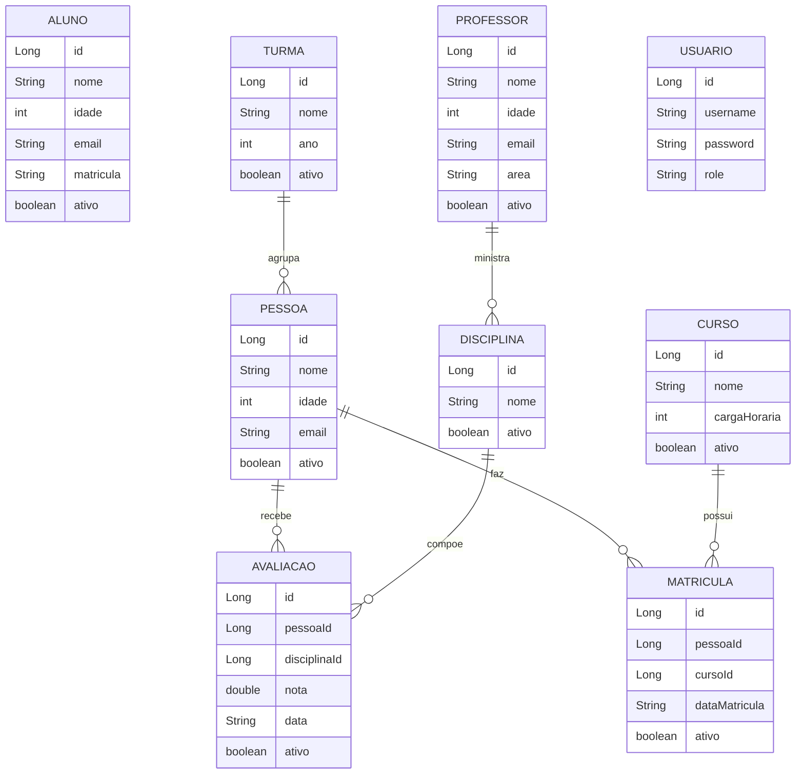

# Sistema de Cadastro Acadêmico — Documentação Completa

> Projeto desenvolvido em Java com Spring Boot, implementado em duas arquiteturas:
> backend monolítico e arquitetura de microserviços.

---

## Índice

1. [Visão Geral](#1-visão-geral)
2. [Arquitetura](#2-arquitetura)
3. [Tecnologias](#3-tecnologias)
4. [Estrutura de Diretórios](#4-estrutura-de-diretórios)
5. [Diagrama de Entidades](#5-diagrama-de-entidades)
6. [Como Executar](#6-como-executar)
7. [Autenticação e Segurança](#7-autenticação-e-segurança)
8. [Endpoints — Backend Monolítico](#8-endpoints--backend-monolítico)
9. [Endpoints — Microserviços](#9-endpoints--microserviços)
10. [Configuração por Serviço](#10-configuração-por-serviço)
11. [Docker e Container](#11-docker-e-container)
12. [Padrões Arquiteturais](#12-padrões-arquiteturais)

---

## 1. Visão Geral

Sistema de cadastro acadêmico para gerenciar entidades de uma instituição de ensino: pessoas, alunos, professores, cursos, disciplinas, turmas, matrículas e avaliações.

O projeto possui **duas implementações paralelas**:

| Implementação | Diretório | Porta Principal |
|---|---|---|
| Backend Monolítico | `backend/` | 8080 |
| Microserviços + API Gateway | `microservicos/` | 8080 (gateway) |

Ambas expõem uma API REST com autenticação JWT e controle de acesso por papéis (PROFESSOR / ALUNO).

---

## 2. Arquitetura

### 2.1 Backend Monolítico

Aplicação Spring Boot única com todas as entidades no mesmo processo. Utiliza banco H2 em memória e Swagger UI para exploração da API.

```
Cliente HTTP
     │
     ▼
Spring Boot (8080)
     │
     ├── SecurityFilter (JWT)
     ├── Controllers (REST)
     ├── Services (lógica)
     ├── Repositories (JPA)
     └── H2 Database (in-memory)
```

### 2.2 Microserviços

Cada domínio é um serviço Spring Boot independente com banco de dados próprio. O API Gateway é o único ponto de entrada externo.

```
Cliente HTTP
     │
     ▼
API Gateway (8080) ─── Spring Cloud Gateway
     │
     ├── /api/matriculas/**  ──► matricula-service  (8081)
     ├── /api/pessoas/**     ──► pessoa-service      (8082)
     ├── /api/cursos/**      ──► curso-service       (8083)
     ├── /api/disciplinas/** ──► disciplina-service  (8084)
     ├── /api/professores/** ──► professor-service   (8085)
     └── /api/turmas/**      ──► turma-service       (8086)

Serviços auxiliares:
  auth-service    (8086) — autenticação JWT
  aluno-service   (8084) — gestão de alunos (com DTOs e soft delete)

Comunicação inter-serviços:
  matricula-service ──RestTemplate──► pessoa-service
  matricula-service ──RestTemplate──► curso-service
```

---

## 3. Tecnologias

| Categoria | Tecnologia | Versão |
|---|---|---|
| Linguagem | Java | 17 |
| Framework principal | Spring Boot | 3.2.5 |
| API Gateway | Spring Cloud Gateway | 2023.0.1 |
| Segurança | Spring Security + JJWT | 0.12.5 |
| Persistência | Spring Data JPA / Hibernate | — |
| Banco de dados | H2 (in-memory) | runtime |
| Documentação API | SpringDoc OpenAPI (Swagger) | 2.5.0 |
| Geração de dados | JavaFaker | 1.0.2 |
| Redução de boilerplate | Lombok | 1.18.30 |
| Build | Maven | 3.x |
| Containers | Docker + Docker Compose | — |
| Frontend | Angular + Nginx | — |

---

## 4. Estrutura de Diretórios

```
crudfullstackSpring/
│
├── backend/                            # Backend monolítico
│   ├── src/main/java/com/exemplo/crudmongo/
│   │   ├── CrudMongoApplication.java   # Ponto de entrada
│   │   ├── config/
│   │   │   ├── SecurityConfig.java     # Configuração Spring Security
│   │   │   ├── JwtUtil.java            # Geração e validação de tokens
│   │   │   └── JwtAuthFilter.java      # Filtro JWT nas requisições
│   │   ├── model/                      # Entidades JPA
│   │   ├── repository/                 # Interfaces JpaRepository
│   │   ├── service/                    # Lógica de negócio
│   │   ├── controller/                 # Endpoints REST
│   │   └── dataloader/                 # Dados de teste automáticos
│   ├── src/main/resources/
│   │   └── application.properties
│   ├── ENDPOINTS.md
│   └── pom.xml
│
├── microservicos/
│   ├── api-gateway/                    # Roteador central (Spring Cloud Gateway)
│   ├── auth-service/                   # Autenticação + JWT
│   ├── pessoa-service/                 # Gestão de pessoas       (8082)
│   ├── aluno-service/                  # Gestão de alunos        (8084)
│   ├── professor-service/              # Gestão de professores   (8085)
│   ├── curso-service/                  # Gestão de cursos        (8083)
│   ├── disciplina-service/             # Gestão de disciplinas   (8084)
│   ├── turma-service/                  # Gestão de turmas        (8086)
│   ├── matricula-service/              # Gestão de matrículas    (8081)
│   └── start-all.sh                    # Script para subir todos os serviços
│
├── frontend/                           # Aplicação Angular
├── diagramas/                          # Diagramas Mermaid das entidades
├── docker-compose.yml                  # Orquestração de containers
├── Dockerfile                          # Imagem do backend
└── README.md
```

Estrutura interna padrão de cada microserviço:

```
{nome}-service/
├── src/main/java/com/exemplo/{nome}service/
│   ├── {Nome}ServiceApplication.java
│   ├── model/
│   ├── dto/                            # (onde aplicável)
│   ├── repository/
│   ├── service/
│   ├── controller/
│   ├── config/
│   └── exception/                      # (onde aplicável)
├── src/main/resources/application.properties
├── Dockerfile
└── pom.xml
```

---

## 5. Diagrama de Entidades



---

## 6. Como Executar

### 6.1 Pré-requisitos

- Java 17+
- Maven 3.x
- Docker e Docker Compose (para execução containerizada)

### 6.2 Backend Monolítico — Local

```bash
cd backend
mvn spring-boot:run
```

Acesse:
- API: `http://localhost:8080`
- Swagger UI: `http://localhost:8080/swagger-ui.html`
- H2 Console: `http://localhost:8080/h2-console`
  - JDBC URL: `jdbc:h2:mem:crudmongo`
  - Usuário: `sa` | Senha: `sa`

### 6.3 Microserviços — Local (script)

```bash
cd microservicos
chmod +x start-all.sh
./start-all.sh
```

O script inicia todos os serviços em background com logs em `microservicos/logs/`.

Para parar todos:
```bash
kill $(lsof -ti:8080,8081,8082,8083,8084,8085,8086)
```

### 6.4 Microserviços — Manual (por serviço)

```bash
# Em terminais separados, na ordem recomendada:
cd microservicos/pessoa-service   && mvn spring-boot:run
cd microservicos/curso-service    && mvn spring-boot:run
cd microservicos/disciplina-service && mvn spring-boot:run
cd microservicos/professor-service && mvn spring-boot:run
cd microservicos/turma-service    && mvn spring-boot:run
cd microservicos/aluno-service    && mvn spring-boot:run
cd microservicos/matricula-service && mvn spring-boot:run  # após pessoa e curso
cd microservicos/auth-service     && mvn spring-boot:run
cd microservicos/api-gateway      && mvn spring-boot:run   # por último
```

### 6.5 Docker Compose (todos os serviços)

```bash
docker-compose up --build
```

Serviços disponíveis após inicialização:

| Serviço | URL |
|---|---|
| Backend Monolítico | `http://localhost:8080` |
| API Gateway | `http://localhost:8087` |
| Frontend Angular | `http://localhost:4200` |
| matricula-service | `http://localhost:8081` |
| pessoa-service | `http://localhost:8082` |
| curso-service | `http://localhost:8083` |
| disciplina-service | `http://localhost:8084` |
| professor-service | `http://localhost:8085` |
| turma-service | `http://localhost:8086` |

---

## 7. Autenticação e Segurança

Ambas as implementações utilizam **JWT (JSON Web Token)** com controle de acesso por papel.

### Papéis disponíveis

| Papel | Permissões |
|---|---|
| `PROFESSOR` | GET, POST, PUT, PATCH, DELETE |
| `ALUNO` | Apenas GET |

### Fluxo de autenticação

```
1. POST /api/auth/login  →  recebe token JWT
2. Usar o token em todas as requisições:
   Header: Authorization: Bearer <token>
```

### Backend Monolítico — Endpoints de Auth

```
POST /api/auth/login       (público)
POST /api/auth/register    (requer PROFESSOR)
```

**Login:**
```json
// Request
POST /api/auth/login
{
  "username": "professor@escola.com",
  "password": "123456"
}

// Response
{
  "token": "eyJhbGciOiJIUzI1NiJ9..."
}
```

### Auth-Service (Microserviços) — Endpoints

```
POST /auth/login      (público)
POST /auth/registrar  (público no microserviço)
```

**Login:**
```json
// Request
POST /auth/login
{
  "username": "admin",
  "password": "123456"
}

// Response
{
  "token": "eyJhbGciOiJIUzI1NiJ9...",
  "role": "PROFESSOR",
  "username": "admin",
  "tipo": "Bearer",
  "expiresIn": "3600 segundos"
}
```

**Registrar:**
```json
// Request
POST /auth/registrar
{
  "username": "joao.silva",
  "password": "minhasenha",
  "role": "ALUNO"
}

// Response
{
  "mensagem": "Usuário registrado com sucesso!",
  "username": "joao.silva",
  "role": "ALUNO"
}
```

### Configurações JWT

| Parâmetro | Backend Monolítico | Auth-Service |
|---|---|---|
| Secret | `minha-chave-secreta-super-segura-32bytes!!` | `microservicos-chave-secreta-super-segura-32bytes!!` |
| Expiração | 3600000 ms (1 hora) | 3600000 ms (1 hora) |
| Algoritmo | HS256 | HS256 |

---

## 8. Endpoints — Backend Monolítico

**Base URL:** `http://localhost:8080`

**Header obrigatório (exceto login):**
```
Authorization: Bearer <token>
```

### Pessoa

| Método | Endpoint | Role | Descrição |
|---|---|---|---|
| GET | `/api/pessoas` | ALUNO, PROFESSOR | Lista todas as pessoas |
| POST | `/api/pessoas` | PROFESSOR | Cria uma pessoa |
| PUT | `/api/pessoas/{id}` | PROFESSOR | Atualiza uma pessoa |
| DELETE | `/api/pessoas/{id}` | PROFESSOR | Remove uma pessoa |

```json
// Body (POST / PUT)
{
  "nome": "João da Silva",
  "idade": 22,
  "email": "joao@email.com",
  "ativo": true
}
```

### Curso

| Método | Endpoint | Role | Descrição |
|---|---|---|---|
| GET | `/api/curso` | ALUNO, PROFESSOR | Lista todos os cursos |
| POST | `/api/curso` | PROFESSOR | Cria um curso |
| PUT | `/api/curso/{id}` | PROFESSOR | Atualiza um curso |
| DELETE | `/api/curso/{id}` | PROFESSOR | Remove um curso |

```json
// Body (POST / PUT)
{
  "nome": "Engenharia de Software",
  "cargaHoraria": 3600,
  "ativo": true
}
```

### Professor

| Método | Endpoint | Role | Descrição |
|---|---|---|---|
| GET | `/professores` | ALUNO, PROFESSOR | Lista todos |
| GET | `/professores/{id}` | ALUNO, PROFESSOR | Busca por ID |
| POST | `/professores` | PROFESSOR | Cria |
| PUT | `/professores/{id}` | PROFESSOR | Atualiza |
| DELETE | `/professores/{id}` | PROFESSOR | Remove |

```json
// Body (POST / PUT)
{
  "nome": "Maria Oliveira",
  "idade": 42,
  "email": "maria.oliveira@escola.com",
  "area": "Matemática",
  "ativo": true
}
```

### Disciplina

| Método | Endpoint | Descrição |
|---|---|---|
| GET | `/disciplinas` | Lista todas |
| GET | `/disciplinas/{id}` | Busca por ID |
| POST | `/disciplinas` | Cria |
| PUT | `/disciplinas/{id}` | Atualiza |
| DELETE | `/disciplinas/{id}` | Remove |

```json
// Body (POST / PUT)
{
  "nome": "Cálculo I",
  "ativo": true
}
```

### Turma

| Método | Endpoint | Descrição |
|---|---|---|
| GET | `/turmas` | Lista todas |
| GET | `/turmas/{id}` | Busca por ID |
| POST | `/turmas` | Cria |
| PUT | `/turmas/{id}` | Atualiza |
| DELETE | `/turmas/{id}` | Remove |

```json
// Body (POST / PUT)
{
  "nome": "Turma A - Noite",
  "ano": 2025,
  "ativo": true
}
```

### Matrícula

| Método | Endpoint | Descrição |
|---|---|---|
| GET | `/matriculas` | Lista todas |
| GET | `/matriculas/{id}` | Busca por ID |
| POST | `/matriculas` | Cria |
| PUT | `/matriculas/{id}` | Atualiza |
| DELETE | `/matriculas/{id}` | Remove |

```json
// Body (POST / PUT)
{
  "pessoaId": 1,
  "cursoId": 2,
  "dataMatricula": "2025-02-01",
  "ativo": true
}
```

### Avaliação

| Método | Endpoint | Descrição |
|---|---|---|
| GET | `/avaliacoes` | Lista todas |
| GET | `/avaliacoes/{id}` | Busca por ID |
| POST | `/avaliacoes` | Cria |
| PUT | `/avaliacoes/{id}` | Atualiza |
| DELETE | `/avaliacoes/{id}` | Remove |

```json
// Body (POST / PUT)
{
  "pessoaId": 1,
  "disciplinaId": 3,
  "nota": 8.5,
  "data": "2025-06-15",
  "ativo": true
}
```

---

## 9. Endpoints — Microserviços

Todos os endpoints abaixo são acessíveis via **API Gateway** na porta `8080` (ou `8087` no Docker). Também podem ser acessados diretamente nas portas individuais de cada serviço.

### 9.1 API Gateway

**Base URL Gateway:** `http://localhost:8080`

**Tabela de roteamento:**

| Path | Serviço destino | Porta direta |
|---|---|---|
| `/api/matriculas/**` | matricula-service | 8081 |
| `/api/pessoas/**` | pessoa-service | 8082 |
| `/api/cursos/**` | curso-service | 8083 |
| `/api/disciplinas/**` | disciplina-service | 8084 |
| `/api/professores/**` | professor-service | 8085 |
| `/api/turmas/**` | turma-service | 8086 |

**Health check do gateway:**
```
GET /actuator/health
GET /actuator/gateway/routes
```

### 9.2 Pessoa-Service (8082)

Gerencia o cadastro de pessoas genéricas.

| Método | Endpoint | Descrição |
|---|---|---|
| GET | `/api/pessoas` | Lista todas as pessoas |
| GET | `/api/pessoas/{id}` | Busca pessoa por ID |
| POST | `/api/pessoas` | Cria uma pessoa |
| PUT | `/api/pessoas/{id}` | Atualiza uma pessoa |
| DELETE | `/api/pessoas/{id}` | Remove uma pessoa |

```json
// Body (POST / PUT)
{
  "nome": "Ana Costa",
  "idade": 25,
  "email": "ana.costa@email.com",
  "ativo": true
}
```

```json
// Resposta de sucesso (GET)
{
  "id": 1,
  "nome": "Ana Costa",
  "idade": 25,
  "email": "ana.costa@email.com",
  "ativo": true
}
```

H2 Console: `http://localhost:8082/h2-console` (DB: `jdbc:h2:mem:pessoadb`)

---

### 9.3 Aluno-Service (8084)

Gerencia alunos com padrão DTO e suporte a soft delete.

| Método | Endpoint | Descrição |
|---|---|---|
| GET | `/alunos` | Lista todos os alunos |
| GET | `/alunos/{id}` | Busca aluno por ID |
| POST | `/alunos` | Cria um aluno |
| PUT | `/alunos/{id}` | Atualiza um aluno |
| PATCH | `/alunos/{id}/desativar` | Desativa (soft delete) |
| DELETE | `/alunos/{id}` | Remove definitivamente |

```json
// Body (POST) — AlunoRequestDTO
{
  "nome": "Pedro Alves",
  "idade": 20,
  "email": "pedro.alves@email.com",
  "matricula": "2025001"
}
```

```json
// Resposta (GET) — AlunoResponseDTO
{
  "id": 1,
  "nome": "Pedro Alves",
  "email": "pedro.alves@email.com",
  "matricula": "2025001",
  "ativo": true
}
```

H2 Console: `http://localhost:8084/h2-console` (DB: `jdbc:h2:mem:alunodb`)

---

### 9.4 Professor-Service (8085)

Gerencia professores com padrão DTO.

| Método | Endpoint | Descrição |
|---|---|---|
| GET | `/api/professores` | Lista todos |
| GET | `/api/professores/{id}` | Busca por ID |
| POST | `/api/professores` | Cria |
| PUT | `/api/professores/{id}` | Atualiza |
| PATCH | `/api/professores/{id}/desativar` | Soft delete |
| DELETE | `/api/professores/{id}` | Remove |

```json
// Body (POST) — ProfessorRequestDTO
{
  "nome": "Carlos Mendes",
  "idade": 45,
  "email": "carlos.mendes@escola.com",
  "area": "Física"
}
```

```json
// Resposta — ProfessorResponseDTO
{
  "id": 1,
  "nome": "Carlos Mendes",
  "email": "carlos.mendes@escola.com",
  "area": "Física",
  "ativo": true
}
```

H2 Console: `http://localhost:8085/h2-console` (DB: `jdbc:h2:mem:professordb`)

---

### 9.5 Curso-Service (8083)

| Método | Endpoint | Descrição |
|---|---|---|
| GET | `/api/cursos` | Lista todos |
| GET | `/api/cursos/{id}` | Busca por ID |
| POST | `/api/cursos` | Cria |
| PUT | `/api/cursos/{id}` | Atualiza |
| DELETE | `/api/cursos/{id}` | Remove |

```json
// Body (POST / PUT) — CursoRequestDTO
{
  "nome": "Ciência da Computação",
  "ativo": true
}
```

H2 Console: `http://localhost:8083/h2-console` (DB: `jdbc:h2:mem:cursodb`)

---

### 9.6 Disciplina-Service (8084)

> Atenção: porta 8084 é compartilhada com aluno-service em execução local.
> No Docker, cada um tem seu container isolado.

| Método | Endpoint | Descrição |
|---|---|---|
| GET | `/api/disciplinas` | Lista todas |
| GET | `/api/disciplinas/{id}` | Busca por ID |
| POST | `/api/disciplinas` | Cria |
| PUT | `/api/disciplinas/{id}` | Atualiza |
| DELETE | `/api/disciplinas/{id}` | Remove |

```json
// Body (POST / PUT)
{
  "nome": "Estruturas de Dados",
  "ativo": true
}
```

H2 Console: `http://localhost:8084/h2-console` (DB: `jdbc:h2:mem:disciplinadb`)

---

### 9.7 Turma-Service (8086)

| Método | Endpoint | Descrição |
|---|---|---|
| GET | `/api/turmas` | Lista todas |
| GET | `/api/turmas/{id}` | Busca por ID |
| POST | `/api/turmas` | Cria |
| PUT | `/api/turmas/{id}` | Atualiza |
| DELETE | `/api/turmas/{id}` | Remove |

```json
// Body (POST / PUT)
{
  "nome": "Turma B - Manhã",
  "ano": 2025,
  "ativo": true
}
```

H2 Console: `http://localhost:8086/h2-console` (DB: `jdbc:h2:mem:turmadb`)

---

### 9.8 Matricula-Service (8081)

O serviço mais completo: consulta outros serviços via `RestTemplate` para retornar dados enriquecidos.

| Método | Endpoint | Descrição |
|---|---|---|
| GET | `/api/matriculas` | Lista todas as matrículas |
| GET | `/api/matriculas/{id}` | Busca detalhada (inclui nomes de Pessoa e Curso) |
| GET | `/api/matriculas/pessoa/{pessoaId}` | Filtra por pessoa |
| GET | `/api/matriculas/curso/{cursoId}` | Filtra por curso |
| POST | `/api/matriculas` | Cria matrícula |
| PUT | `/api/matriculas/{id}` | Atualiza matrícula |
| PATCH | `/api/matriculas/{id}/desativar` | Soft delete |
| DELETE | `/api/matriculas/{id}` | Remove definitivamente |

```json
// Body (POST) — MatriculaRequestDTO
{
  "pessoaId": 1,
  "cursoId": 2,
  "dataMatricula": "2025-03-01"
}
```

```json
// Resposta simples — MatriculaResponseDTO
{
  "id": 1,
  "pessoaId": 1,
  "cursoId": 2,
  "dataMatricula": "2025-03-01",
  "ativo": true
}
```

```json
// Resposta detalhada (GET /api/matriculas/{id}) — MatriculaDetalhadaDTO
{
  "id": 1,
  "pessoaId": 1,
  "nomePessoa": "Ana Costa",
  "cursoId": 2,
  "nomeCurso": "Ciência da Computação",
  "dataMatricula": "2025-03-01",
  "ativo": true
}
```

> Se pessoa-service ou curso-service estiverem indisponíveis, os campos de nome retornam `"indisponível"` sem quebrar a requisição.

**Variáveis de ambiente:**

| Variável | Padrão |
|---|---|
| `PESSOA_SERVICE_URL` | `http://localhost:8082/api/pessoas` |
| `CURSO_SERVICE_URL` | `http://localhost:8083/api/cursos` |

H2 Console: `http://localhost:8081/h2-console` (DB: `jdbc:h2:mem:matriculadb`)

---

### 9.9 Auth-Service (8086)

Veja a seção [7. Autenticação e Segurança](#7-autenticação-e-segurança).

---

## 10. Configuração por Serviço

### Backend Monolítico (`backend/src/main/resources/application.properties`)

```properties
server.port=8080
spring.datasource.url=jdbc:h2:mem:crudmongo
spring.datasource.driver-class-name=org.h2.Driver
spring.datasource.username=sa
spring.datasource.password=sa
spring.jpa.database-platform=org.hibernate.dialect.H2Dialect
spring.jpa.hibernate.ddl-auto=update
spring.h2.console.enabled=true
spring.h2.console.path=/h2-console
spring.jpa.show-sql=true
```

### Padrão comum — todos os microserviços

```properties
spring.datasource.driver-class-name=org.h2.Driver
spring.datasource.username=sa
spring.datasource.password=sa
spring.jpa.database-platform=org.hibernate.dialect.H2Dialect
spring.jpa.hibernate.ddl-auto=update
spring.h2.console.enabled=true
spring.h2.console.path=/h2-console
spring.jpa.show-sql=true
```

### Portas e bancos por serviço

| Serviço | Porta | Banco H2 |
|---|---|---|
| matricula-service | 8081 | `jdbc:h2:mem:matriculadb` |
| pessoa-service | 8082 | `jdbc:h2:mem:pessoadb` |
| curso-service | 8083 | `jdbc:h2:mem:cursodb` |
| disciplina-service | 8084 | `jdbc:h2:mem:disciplinadb` |
| aluno-service | 8084 | `jdbc:h2:mem:alunodb` |
| professor-service | 8085 | `jdbc:h2:mem:professordb` |
| turma-service | 8086 | `jdbc:h2:mem:turmadb` |
| auth-service | 8086 | `jdbc:h2:mem:authdb` |
| api-gateway | 8080 | — (sem banco) |

### Matricula-Service — configuração extra

```properties
pessoa.service.url=${PESSOA_SERVICE_URL:http://localhost:8082/api/pessoas}
curso.service.url=${CURSO_SERVICE_URL:http://localhost:8083/api/cursos}
```

### Auth-Service — configuração extra

```properties
jwt.secret=microservicos-chave-secreta-super-segura-32bytes!!
jwt.expiration=3600000
```

### API Gateway — rotas completas

```properties
server.port=8080
spring.application.name=api-gateway

spring.cloud.gateway.routes[0].id=matricula-service
spring.cloud.gateway.routes[0].uri=${MATRICULA_SERVICE_URI:http://localhost:8081}
spring.cloud.gateway.routes[0].predicates[0]=Path=/api/matriculas/**

spring.cloud.gateway.routes[1].id=pessoa-service
spring.cloud.gateway.routes[1].uri=${PESSOA_SERVICE_URI:http://localhost:8082}
spring.cloud.gateway.routes[1].predicates[0]=Path=/api/pessoas/**

spring.cloud.gateway.routes[2].id=curso-service
spring.cloud.gateway.routes[2].uri=${CURSO_SERVICE_URI:http://localhost:8083}
spring.cloud.gateway.routes[2].predicates[0]=Path=/api/cursos/**

spring.cloud.gateway.routes[3].id=disciplina-service
spring.cloud.gateway.routes[3].uri=${DISCIPLINA_SERVICE_URI:http://localhost:8084}
spring.cloud.gateway.routes[3].predicates[0]=Path=/api/disciplinas/**

spring.cloud.gateway.routes[4].id=professor-service
spring.cloud.gateway.routes[4].uri=${PROFESSOR_SERVICE_URI:http://localhost:8085}
spring.cloud.gateway.routes[4].predicates[0]=Path=/api/professores/**

spring.cloud.gateway.routes[5].id=turma-service
spring.cloud.gateway.routes[5].uri=${TURMA_SERVICE_URI:http://localhost:8086}
spring.cloud.gateway.routes[5].predicates[0]=Path=/api/turmas/**

spring.cloud.gateway.globalcors.cors-configurations.[/**].allowed-origins=*
spring.cloud.gateway.globalcors.cors-configurations.[/**].allowed-methods=GET,POST,PUT,PATCH,DELETE,OPTIONS
spring.cloud.gateway.globalcors.cors-configurations.[/**].allowed-headers=*

management.endpoints.web.exposure.include=health,info,gateway
management.endpoint.gateway.enabled=true
```

---

## 11. Docker e Container

### docker-compose.yml — Serviços

| Container | Imagem | Porta host:container | Dependências |
|---|---|---|---|
| `crud-springboot` | `./backend/Dockerfile` | 8080:8080 | — |
| `angular-app` | `./frontend` | 4200:80 | app |
| `pessoa-service` | `./microservicos/pessoa-service` | 8082:8082 | — |
| `curso-service` | `./microservicos/curso-service` | 8083:8083 | — |
| `disciplina-service` | `./microservicos/disciplina-service` | 8084:8084 | — |
| `professor-service` | `./microservicos/professor-service` | 8085:8085 | — |
| `turma-service` | `./microservicos/turma-service` | 8086:8086 | — |
| `matricula-service` | `./microservicos/matricula-service` | 8081:8081 | pessoa-service, curso-service |
| `api-gateway` | `./microservicos/api-gateway` | 8087:8080 | todos os serviços |

**Rede:** `app-network` (bridge)

### Variáveis de ambiente no docker-compose (matricula-service)

```yaml
environment:
  PESSOA_SERVICE_URL: http://pessoa-service:8082/api/pessoas
  CURSO_SERVICE_URL: http://curso-service:8083/api/cursos
```

### Variáveis de ambiente no docker-compose (api-gateway)

```yaml
environment:
  MATRICULA_SERVICE_URI: http://matricula-service:8081
  PESSOA_SERVICE_URI: http://pessoa-service:8082
  CURSO_SERVICE_URI: http://curso-service:8083
  DISCIPLINA_SERVICE_URI: http://disciplina-service:8084
  PROFESSOR_SERVICE_URI: http://professor-service:8085
  TURMA_SERVICE_URI: http://turma-service:8086
```

### Comandos Docker úteis

```bash
# Subir todos os serviços
docker-compose up --build

# Subir apenas os microserviços (sem backend monolítico)
docker-compose up pessoa-service curso-service disciplina-service professor-service turma-service matricula-service api-gateway --build

# Ver logs de um serviço específico
docker-compose logs -f matricula-service

# Parar tudo
docker-compose down
```

---

## 12. Padrões Arquiteturais

| Padrão | Onde é utilizado |
|---|---|
| **Service per Entity** | Cada entidade tem seu próprio microserviço independente |
| **Database per Service** | Cada serviço gerencia seu próprio banco H2 isolado |
| **API Gateway** | Spring Cloud Gateway como único ponto de entrada externo |
| **DTO (Request/Response)** | Aluno-Service, Professor-Service, Matricula-Service |
| **Soft Delete** | Flag `ativo` + endpoint PATCH `/desativar` (Aluno, Matricula) |
| **Data Loaders** | Todos os serviços populam dados de teste no startup via `CommandLineRunner` |
| **Global Exception Handler** | Matricula-Service — retorna `ApiError` padronizado |
| **RestTemplate para comunicação** | Matricula-Service consulta Pessoa e Curso em tempo de execução |
| **Graceful degradation** | Matricula-Service retorna "indisponível" se serviço dependente cair |
| **Stateless JWT Auth** | Sessões sem estado com `SessionCreationPolicy.STATELESS` |
| **RBAC** | Papéis PROFESSOR e ALUNO com permissões distintas via Spring Security |
| **CORS global** | Configurado no API Gateway para todas as rotas |

---

## Testando com Postman

### Passo a passo completo

1. **Autenticar** — `POST /api/auth/login` (backend) ou `POST /auth/login` (auth-service)
2. **Copiar o token** retornado no campo `"token"`
3. **Em cada requisição**, adicionar o header:
   ```
   Authorization: Bearer SEU_TOKEN_AQUI
   ```
4. Para GET: nenhum body necessário
5. Para POST/PUT: `Content-Type: application/json` + body JSON
6. Para DELETE: apenas o ID na URL

### Exemplo completo — Matricular uma pessoa em um curso

```
# 1. Login
POST http://localhost:8080/api/auth/login
Content-Type: application/json

{ "username": "professor@escola.com", "password": "123456" }

→ Copie o token da resposta

# 2. Verificar pessoas disponíveis
GET http://localhost:8080/api/pessoas
Authorization: Bearer <token>

# 3. Verificar cursos disponíveis
GET http://localhost:8080/api/curso
Authorization: Bearer <token>

# 4. Criar matrícula
POST http://localhost:8080/matriculas
Authorization: Bearer <token>
Content-Type: application/json

{
  "pessoaId": 1,
  "cursoId": 1,
  "dataMatricula": "2025-03-01",
  "ativo": true
}

# 5. Consultar matrícula (via microserviço — retorna nomes enriquecidos)
GET http://localhost:8080/api/matriculas/1
Authorization: Bearer <token>
```

---

*Documentação gerada em 2026-05-26.*
