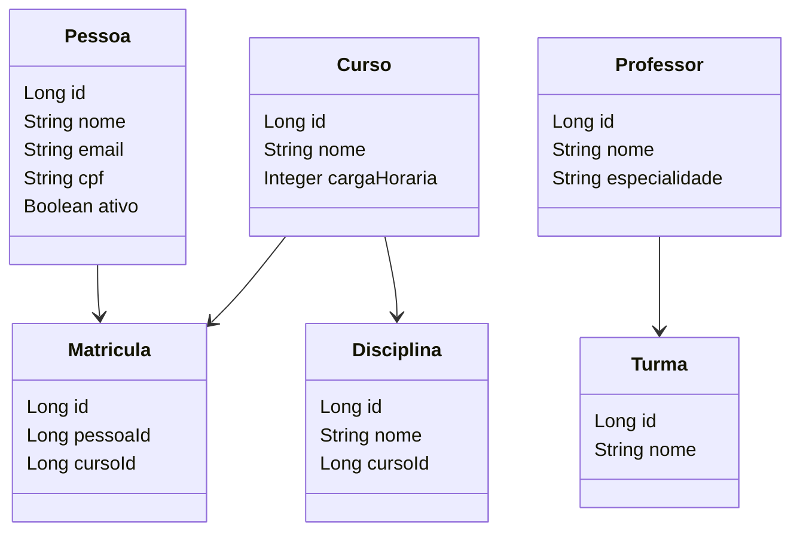
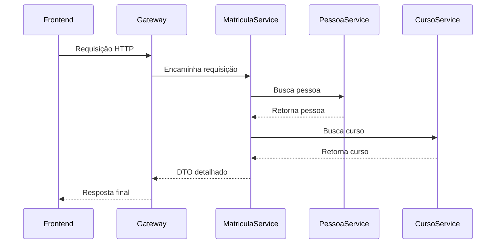

# Backend Spring Boot

CRUD com MongoDB Atlas

## Endpoints criados e exemplos de uso

Os endpoints das novas entidades seguem o padrão REST com autenticação JWT. Para testar operações de criação, atualização e exclusão, faça login como professor:

```bash
curl -X POST http://localhost:8080/api/auth/login \
  -H "Content-Type: application/json" \
  -d '{"username":"professor","password":"prof123"}'
```

Use o valor retornado em `token` no header:

```bash
Authorization: Bearer SEU_TOKEN
```

### Professor

- `GET /api/professores`
- `POST /api/professores`
- `PUT /api/professores/{id}`
- `DELETE /api/professores/{id}`

```bash
curl -X POST http://localhost:8080/api/professores \
  -H "Content-Type: application/json" \
  -H "Authorization: Bearer SEU_TOKEN" \
  -d '{"nome":"Professor Teste","area":"Fisica","ativo":true}'
```

### Disciplina

- `GET /api/disciplinas`
- `POST /api/disciplinas`
- `PUT /api/disciplinas/{id}`
- `DELETE /api/disciplinas/{id}`

```bash
curl -X POST http://localhost:8080/api/disciplinas \
  -H "Content-Type: application/json" \
  -H "Authorization: Bearer SEU_TOKEN" \
  -d '{"nome":"Disciplina Teste","cargaHoraria":60,"professorId":1,"ativo":true}'
```

### Turma

- `GET /api/turmas`
- `POST /api/turmas`
- `PUT /api/turmas/{id}`
- `DELETE /api/turmas/{id}`

```bash
curl -X POST http://localhost:8080/api/turmas \
  -H "Content-Type: application/json" \
  -H "Authorization: Bearer SEU_TOKEN" \
  -d '{"nome":"Turma Teste","ano":2026,"ativo":true}'
```

### Matricula

- `GET /api/matriculas`
- `POST /api/matriculas`
- `PUT /api/matriculas/{id}`
- `DELETE /api/matriculas/{id}`

```bash
curl -X POST http://localhost:8080/api/matriculas \
  -H "Content-Type: application/json" \
  -H "Authorization: Bearer SEU_TOKEN" \
  -d '{"pessoaId":1,"cursoId":1,"dataMatricula":"2026-05-10","ativo":true}'
```

### Avaliacao

- `GET /api/avaliacoes`
- `POST /api/avaliacoes`
- `PUT /api/avaliacoes/{id}`
- `DELETE /api/avaliacoes/{id}`

```bash
curl -X POST http://localhost:8080/api/avaliacoes \
  -H "Content-Type: application/json" \
  -H "Authorization: Bearer SEU_TOKEN" \
  -d '{"pessoaId":1,"disciplinaId":1,"nota":8.5,"data":"2026-05-10","ativo":true}'
```

Exemplo de atualização:

```bash
curl -X PUT http://localhost:8080/api/turmas/1 \
  -H "Content-Type: application/json" \
  -H "Authorization: Bearer SEU_TOKEN" \
  -d '{"nome":"Turma Atualizada","ano":2027,"ativo":false}'
```

Exemplo de exclusão:

```bash
curl -X DELETE http://localhost:8080/api/turmas/1 \
  -H "Authorization: Bearer SEU_TOKEN"
```

# CRUD FullStack Spring — Relatório Técnico e Documentação Completa

## 📘 Sumário

1. Introdução
2. Objetivo do Projeto
3. Visão Geral da Arquitetura
4. Tecnologias Utilizadas
5. Estrutura do Projeto
6. Funcionamento Geral do Sistema
7. Microserviços Implementados
8. Regras de Negócio
9. Casos de Uso
10. Fluxo de Comunicação entre Serviços
11. API Gateway
12. Segurança e Autenticação
13. Tratamento de Erros
14. Docker e Containers
15. Banco de Dados
16. Diagramas
17. Endpoints Principais
18. Melhorias Implementadas
19. Como Executar o Projeto
20. Conclusão

---

# 1. 📖 Introdução

O projeto **CRUD FullStack Spring** foi desenvolvido com o objetivo de demonstrar uma arquitetura moderna baseada em microserviços utilizando Java com Spring Boot no backend e Angular no frontend.

A aplicação foi criada seguindo boas práticas de separação de responsabilidades, modularização e comunicação entre serviços.

Além disso, o projeto implementa:

- Arquitetura de microserviços
- API Gateway
- Comunicação entre serviços
- Segurança com Spring Security e JWT
- Persistência de dados com JPA
- Banco H2
- Dockerização completa
- Frontend Angular
- Tratamento global de exceções

O sistema simula um ambiente acadêmico onde é possível gerenciar:

- Pessoas
- Cursos
- Professores
- Disciplinas
- Turmas
- Matrículas

---

# 2. 🎯 Objetivo do Projeto

O principal objetivo deste projeto é demonstrar na prática:

- Desenvolvimento Full Stack
- Arquitetura baseada em microserviços
- Comunicação REST entre APIs
- Organização de sistemas distribuídos
- Uso de containers Docker
- Integração entre frontend e backend
- Aplicação de regras de negócio
- Segurança com autenticação JWT

Além disso, o projeto serve como material acadêmico para estudo de:

- Spring Boot
- Angular
- APIs REST
- Microserviços
- Segurança de aplicações
- Docker
- Engenharia de Software

---

# 3. 🏗️ Visão Geral da Arquitetura

O sistema foi dividido em múltiplos microserviços independentes.

Cada serviço possui:

- Controller
- Service
- Repository
- Entity
- Configurações próprias
- Banco de dados H2 individual

Todos os serviços se comunicam através de requisições HTTP utilizando `RestTemplate`.

## Arquitetura Geral

```
[ Frontend Angular ]
          │
          ▼
[ API Gateway - 8080 ]
   │    │    │    │    │
   ▼    ▼    ▼    ▼    ▼
8081 8082 8083 8084 8085 8086
```

---

# 4. 🧰 Tecnologias Utilizadas

## Backend

| Tecnologia | Finalidade |
| --- | --- |
| Java 17 | Linguagem principal |
| Spring Boot 3 | Framework backend |
| Spring Web | APIs REST |
| Spring Data JPA | Persistência de dados |
| Spring Security | Segurança da aplicação |
| JWT | Autenticação |
| Lombok | Redução de boilerplate |
| H2 Database | Banco de dados em memória |
| Maven | Gerenciamento de dependências |
| Swagger/OpenAPI | Documentação da API |
| Java Faker | Geração de dados fake |

## Frontend

| Tecnologia | Finalidade |
| --- | --- |
| Angular 15 | Framework frontend |
| TypeScript | Linguagem principal |
| HTML5 | Estrutura das páginas |
| CSS3 | Estilização |
| RxJS | Programação reativa |

## DevOps

| Tecnologia | Finalidade |
| --- | --- |
| Docker | Containerização |
| Docker Compose | Orquestração dos serviços |
| Nginx | Servidor frontend |

---

# 5. 📂 Estrutura do Projeto

```
crudfullstackSpring/
│
├── backend/
├── frontend/
├── microservicos/
│   ├── matricula-service/
│   ├── pessoa-service/
│   ├── curso-service/
│   ├── disciplina-service/
│   ├── professor-service/
│   ├── turma-service/
│   └── gateway-service/
│
├── diagramas/
├── docker-compose.yml
└── README.md
```

---

# 6. ⚙️ Funcionamento Geral do Sistema

O sistema funciona de forma distribuída.

Cada microserviço é responsável por uma entidade específica.

Exemplo:

- `pessoa-service` → gerencia pessoas
- `curso-service` → gerencia cursos
- `matricula-service` → gerencia matrículas

O frontend envia requisições para o Gateway.

O Gateway identifica qual microserviço deve processar a requisição.

Depois disso:

1. A requisição é encaminhada
2. O microserviço executa a regra de negócio
3. O banco H2 é acessado
4. A resposta retorna ao frontend

---

# 7. 🧩 Microserviços Implementados

## 7.1 Pessoa Service

Responsável pelo gerenciamento de pessoas.

### Funcionalidades

- Cadastro de pessoas
- Atualização de dados
- Exclusão
- Busca por ID
- Busca por CPF
- Busca por e-mail

### Campos

| Campo | Tipo |
| --- | --- |
| id | Long |
| nome | String |
| email | String |
| cpf | String |
| dataNascimento | LocalDate |
| ativo | Boolean |

---

## 7.2 Curso Service

Responsável pelo gerenciamento de cursos.

### Funcionalidades

- Cadastro de cursos
- Alteração de cursos
- Consulta
- Exclusão

### Campos

| Campo | Tipo |
| --- | --- |
| id | Long |
| nome | String |
| descricao | String |
| cargaHoraria | Integer |
| ativo | Boolean |

---

## 7.3 Disciplina Service

Responsável pelas disciplinas acadêmicas.

### Funcionalidades

- CRUD de disciplinas
- Associação com curso
- Consulta por curso

---

## 7.4 Professor Service

Responsável pelos professores.

### Funcionalidades

- CRUD completo
- Busca por especialidade

---

## 7.5 Turma Service

Responsável pelas turmas acadêmicas.

### Funcionalidades

- Cadastro de turmas
- Associação com disciplinas
- Controle de turmas ativas

---

## 7.6 Matrícula Service

Responsável pelas matrículas.

### Funcionalidades

- Cadastro de matrícula
- Consulta detalhada
- Comunicação com outros serviços

### Diferencial

O endpoint:

```
GET /api/matriculas/{id}/detalhada
```

realiza comunicação com:

- pessoa-service
- curso-service

para retornar informações enriquecidas.

---

## 7.7 Gateway Service

Responsável pelo roteamento centralizado.

### Funções

- Entrada única do sistema
- Encaminhamento de requisições
- Centralização das APIs
- Redução do acoplamento frontend/backend

---

# 8. 📋 Regras de Negócio

## Pessoa

- CPF não pode ser duplicado
- E-mail deve ser válido
- Pessoa pode estar ativa ou inativa

## Curso

- Curso deve possuir carga horária positiva
- Curso pode ser ativado/desativado

## Disciplina

- Disciplina deve estar vinculada a um curso

## Matrícula

- Matrícula precisa possuir pessoa válida
- Matrícula precisa possuir curso válido
- Caso um serviço esteja indisponível, o sistema retorna “indisponível” ao invés de quebrar a aplicação

## Professor

- Professor deve possuir especialidade cadastrada

---

# 9. 👨‍💻 Casos de Uso

## Caso de Uso — Cadastro de Pessoa

### Fluxo

1. Usuário envia dados
2. Controller recebe requisição
3. Service valida regras
4. Repository salva no banco
5. Sistema retorna resposta

---

## Caso de Uso — Consulta Detalhada de Matrícula

### Fluxo

1. Usuário consulta matrícula
2. matrícula-service busca dados internos
3. matrícula-service chama pessoa-service
4. matrícula-service chama curso-service
5. DTO detalhado é montado
6. Resposta é retornada

---

## Caso de Uso — Comunicação via Gateway

### Fluxo

1. Frontend envia requisição ao Gateway
2. Gateway identifica rota
3. Gateway redireciona requisição
4. Serviço responde
5. Gateway devolve resposta

---

# 10. 🔄 Fluxo de Comunicação entre Serviços

A comunicação ocorre utilizando:

- REST APIs
- HTTP
- JSON
- RestTemplate

## Exemplo

```
matricula-service
        │
        ├── chama pessoa-service
        │
        └── chama curso-service
```

---

# 11. 🌐 API Gateway

O Gateway foi implementado para centralizar o acesso às APIs.

## Benefícios

- Segurança centralizada
- Ponto único de entrada
- Organização da arquitetura
- Facilidade de manutenção
- Melhor integração frontend/backend

## Porta

```
8080
```

---

# 12. 🔐 Segurança e Autenticação

O sistema utiliza:

- Spring Security
- JWT (JSON Web Token)

## Objetivos da segurança

- Autenticação de usuários
- Proteção de endpoints
- Controle de acesso
- Segurança stateless

## Fluxo JWT

```
Usuário faz login
        │
        ▼
Servidor gera token JWT
        │
        ▼
Cliente envia token nas requisições
        │
        ▼
Backend valida token
```

---

# 13. ❌ Tratamento de Erros

Foi implementado um `GlobalExceptionHandler`.

## Objetivos

- Evitar erros genéricos do Spring
- Padronizar respostas
- Melhorar experiência do usuário
- Facilitar manutenção

## Exemplo de Resposta

```json
{
  "status": 500,
  "mensagem": "Erro interno",
  "timestamp": "2026-05-13T10:00:00"
}
```

---

# 14. 🐳 Docker e Containers

Todos os serviços foram dockerizados.

## Recursos implementados

- Dockerfile individual
- Docker Compose
- Rede compartilhada
- Inicialização conjunta

## Comando principal

```bash
docker-compose up --build
```

---

# 15. 🗄️ Banco de Dados

Foi utilizado o banco H2.

## Características

- Banco em memória
- Leve
- Ideal para estudos
- Fácil integração com Spring

## Console H2

```
/h2-console
```

---

# 16. 📊 Diagramas

## Diagrama de Classes



---

## Diagrama de Sequência



---

# 17. 📡 Endpoints Principais

## Pessoa Service

| Método | Endpoint |
| --- | --- |
| GET | /api/pessoas |
| GET | /api/pessoas/{id} |
| POST | /api/pessoas |
| PUT | /api/pessoas/{id} |
| DELETE | /api/pessoas/{id} |

---

## Curso Service

| Método | Endpoint |
| --- | --- |
| GET | /api/cursos |
| POST | /api/cursos |
| PUT | /api/cursos/{id} |
| DELETE | /api/cursos/{id} |

---

## Matrícula Service

| Método | Endpoint |
| --- | --- |
| GET | /api/matriculas |
| GET | /api/matriculas/{id}/detalhada |
| POST | /api/matriculas |

---

# 18. 🚀 Melhorias Implementadas

## Melhorias de Arquitetura

- Separação em microserviços
- Gateway centralizado
- Comunicação distribuída

## Melhorias de Segurança

- JWT
- Spring Security
- Controle de acesso

## Melhorias de Infraestrutura

- Docker
- Docker Compose
- Containers independentes

## Melhorias de Código

- Tratamento global de erros
- DTOs
- Organização em camadas
- Uso de boas práticas

---

# 19. ▶️ Como Executar o Projeto

## Pré-requisitos

- Java 17
- Maven
- Docker
- Docker Compose
- Node.js
- Angular CLI

---

## Executando com Docker

```bash
docker-compose up --build
```

---

## Executando Backend Manualmente

```bash
cd microservicos/pessoa-service
mvn spring-boot:run
```

---

## Executando Frontend

```bash
cd frontend
npm install
npm start
```

---

# 20. ✅ Conclusão

O projeto CRUD FullStack Spring demonstra a construção de uma aplicação moderna utilizando arquitetura de microserviços.

Durante o desenvolvimento foram aplicados conceitos importantes da engenharia de software, tais como:

- Modularização
- Separação de responsabilidades
- Comunicação entre APIs
- Segurança
- Dockerização
- Arquitetura distribuída
- Organização Full Stack

Além disso, o sistema apresenta uma estrutura escalável e preparada para futuras melhorias, como:

- Banco de dados persistente
- Kubernetes
- Mensageria
- Service Discovery
- Observabilidade
- CI/CD
- Testes automatizados

---

# 👨‍💻 Autor

Projeto desenvolvido para fins acadêmicos e educacionais utilizando Java, Spring Boot, Angular e Docker.
